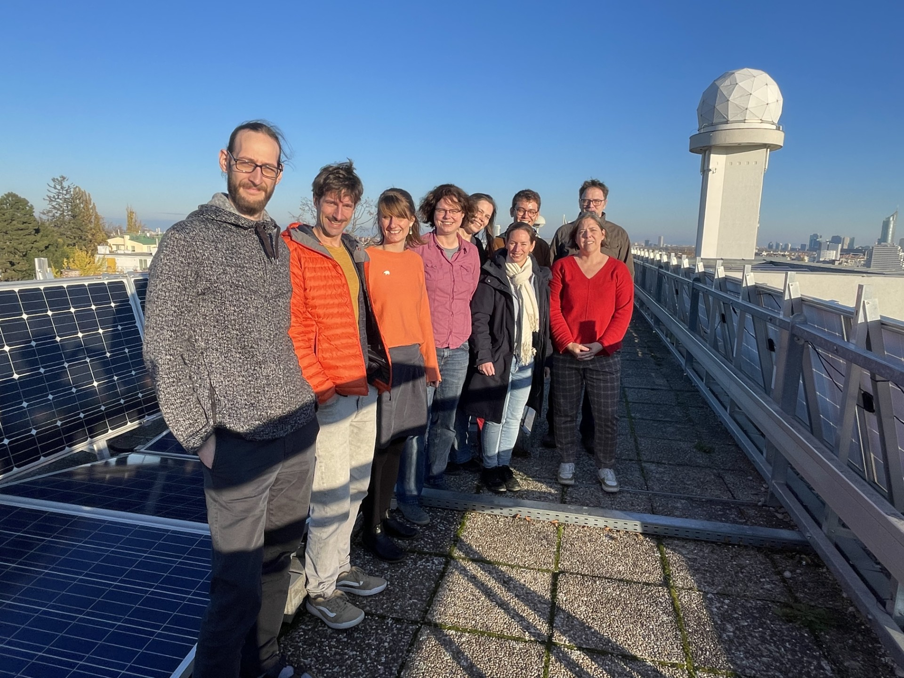

This is a retrospective contribution summarizing our kick-off.

Last November, the EnergyProtect kick-off was held at GeoSphere Austria. Participants were the project members of AIT and GeoSphere Austria who discussed in a work lunch meeting the next steps in EnergyProtect, workflow and responibilities, and more.

A stakeholder workshop will take place in 2024.