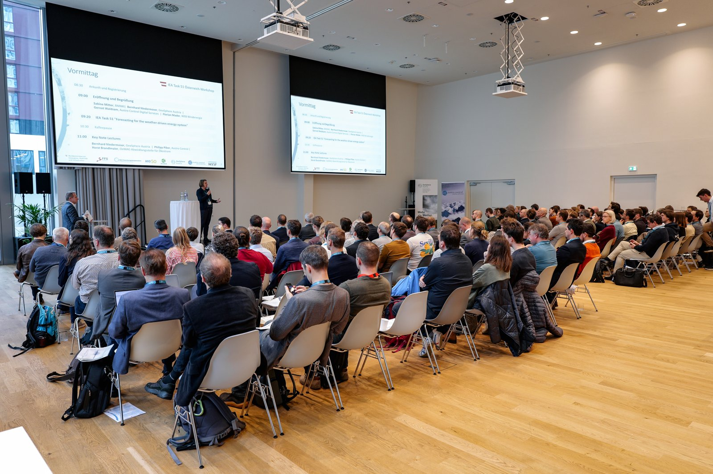
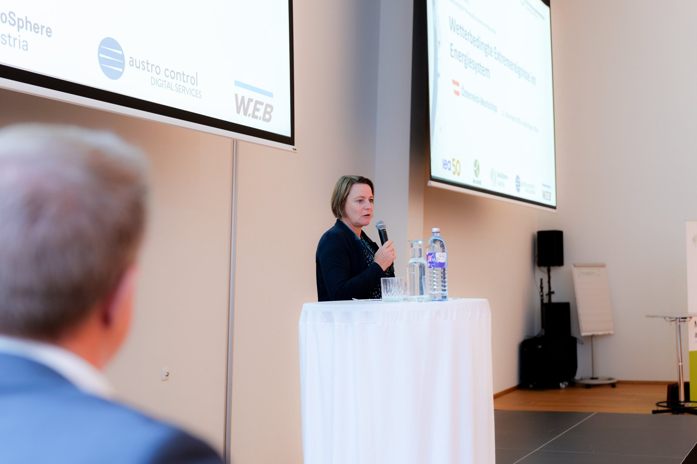
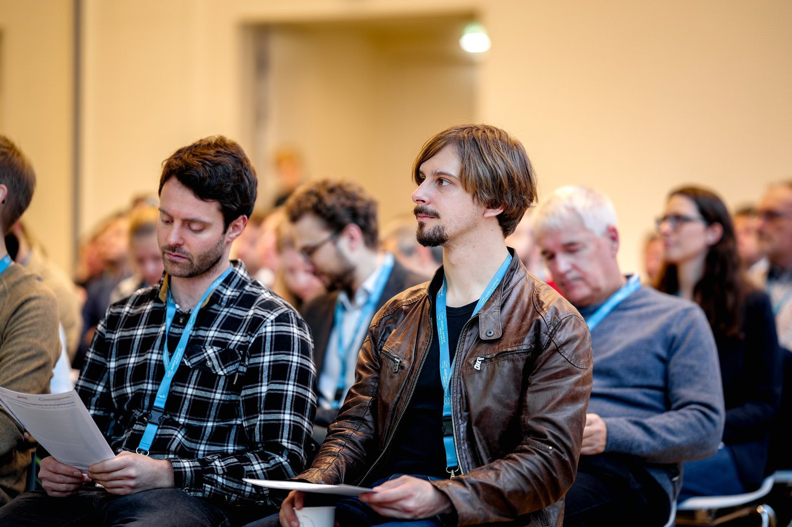
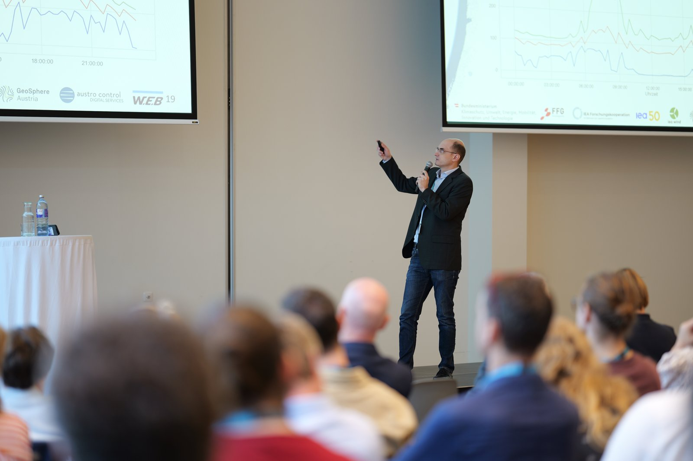
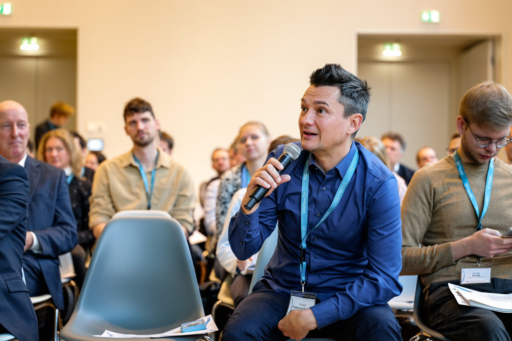
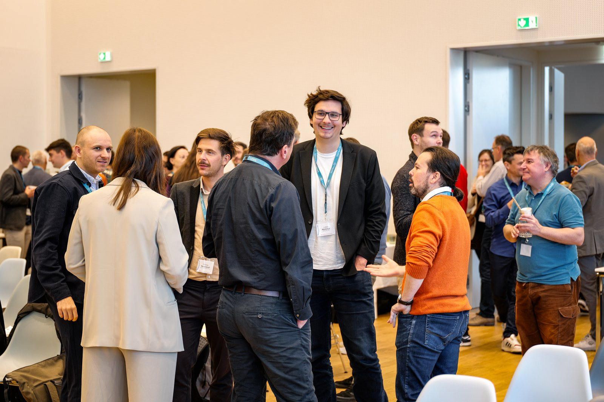

# "IEA Task 51 / Forecasting for the weather-driven energy system" – 2. Österreich-Workshop

Welche Auswirkungen hat **Extremwetter** auf das Energiesystem? Welche Vulnerabilitäten bringt die hohe **Volatilität** der Erneuerbaren heute und unter **Klimawandel** mit sich? Und wie können Energiewirtschaft, Forschung und Wetterexpert:innen **resilientere Energiesysteme** gestalten?

Diese Fragen standen im Mittelpunkt des 2. #IEA Task 51 Österreich-Workshops am **11. November 2025** im Austro Tower in Wien. **125 Expert:innen** aus mehr als 60 Unternehmen, Forschungseinrichtungen und Behörden diskutierten – von **Prognosefehlern** und **Grenzen der Vorhersagbarkeit** über **Warnsysteme** und **operationelle Entscheidungsunterstützung** bis hin zu **Digitalen Zwillingen**, **Nowcasting** und **KI** für Netze, Märkte und Erzeugung.

**Key Notes (Auswahl):**

- Bernhard Niedermoser (GeoSphere Austria): *Extremwetter im Alpenraum – Impakt auf Erzeugung & Transport*  
- Philipp Piber (Austro Control): *Extremwetterauswirkungen auf den Flugverkehr*  
- Horst Brandlmaier (OeMAG): *Wetterbedingte Extremereignisse auf den Energiemärkten*

**Präsentationen und Materialien (Zenodo, DOI):**  

Alle Präsentationen (Einzel-PDFs & ZIP) sind **langfristig** archiviert:  
<https://doi.org/10.5281/zenodo.17627028>

**Und auch [**hier**](https://iea-task-51-austria.github.io/workshops/workshop_2025_rueckblick ) abrufbar**

::: {.download-all-button .text-center .mb-5 .mt-4}
<a href="https://zenodo.org/records/17627028/files/ALL_PRESENTATIONS.zip?download=1" class="btn btn-large btn-primary">
  <i class="fas fa-download"></i> Alle Präsentationen (ZIP)
</a>
:::

## Impressionen

::: {#impressions lightbox="auto"}
{fig-alt="Blick ins Plenum während der Eröffnung" fig-cap="Plenum und Eröffnung · Foto: (c) Philipp Stambera, FFG "}
{fig-alt="Begrüßung der Teilnehmer" fig-cap="Begrüßung · Foto: (c) Philipp Stambera, FFG"}
{fig-alt="Teilnehmer" fig-cap="Teilnehmer · Foto: (c) Philipp Stambera, FFG"}
{fig-alt="Teilnehmer" fig-cap="ITeilnehmer · Foto: (c) Philipp Stambera, FFG"}
{fig-alt="Präsentieren" fig-cap="Präsentieren · Foto: (c) Philipp Stambera, FFG"}
{fig-alt="Fragen" fig-cap="Fragen · Foto: (c) Philipp Stambera, FFG"}
{fig-alt="Networking" fig-cap="Networking · Foto: (c) Philipp Stambera, FFG"}
:::

## Danke & Ausblick

Ein großes **Danke** an alle Vortragenden, Diskutant:innen und das Organisations-Team von GeoSphere Austria & Austro Control Digital Services. Wir freuen uns auf den weiteren Austausch 2026 und auf nächste Schritte zur **Resilienz** des wettergetriebenen Energiesystems!

---

**Archiv & Zitation:**  
- Zenodo (DOI): <https://doi.org/10.5281/zenodo.17627028>  
- Lizenz: CC BY 4.0 – © 2025 GeoSphere Austria, Austro Control Digital Services und Mitwirkende  
  *Teilen & Anpassen erlaubt – bitte Autor:innen und dieses Archiv nennen.*
