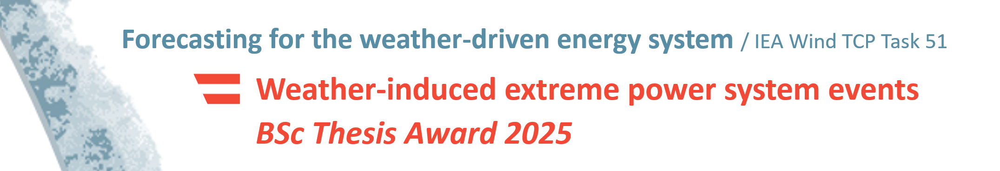

::: column-margin
```{r, echo=FALSE}

```
:::

# Weather-induced extreme power system events​ - BSc Thesis Award 2025​

## What is IEA Wind TCP Task 51?​

The energy system of the future is a weather-driven one – a system in​ which weather conditions such as wind and solar irradiation profoundly impact energy generation and transport. Accurate weather predictions are therefore strategically important to ensure efficient and reliable operation of the energy infrastructure. In the next years, the energy sector faces exceptional challenges, such as the ever-increasing complexity of (decentralized) energy systems and the intensification of weather extremes driven by climate change.
Adressing these challenges is at the core of the international IEA​
Wind TCP Task 51, “Forecasting for the weather-driven energy ​
system”. The task is part of the Wind Technology Collaboration​
Programme (Wind TCP) of the International Energy Agency (IEA). Austrian activities are spearheaded by GeoSphere Austria, Austro Control Digital Services, and WEB Windenergie. The aim is to consolidate the expertise of national and global industry leaders and researchers in energy forecasting and to identify and advance current frontiers in research.​

## BSc Thesis Award 2025 / Announcement
To raise awareness of the important subject and complement their​
national research activities, the IEA Task 51 Austria is calling for Bachelor theses on the topic of Weather-driven extreme power system events. All Bachelor theses submitted at Austrian universities by 31 August 2025 will be reviewed by an interdisciplinary jury – three excellent Bachelor theses will receive awards. Detailed information can be found on the next page.


<!-- Button for downloading the PDF -->
<a href="https://iea-task-51-austria.github.io/bsc_thesis_award/files/BSc_Thesis_Award_2025.pdf" download="./files/BSc_Thesis_Award_2025.pdf" class="btn btn-primary" role="button">
  More information is in the PDF!
</a>

<iframe src="./files/BSc_Thesis_Award_2025.pdf" width="100%" height="600px">
</iframe>
