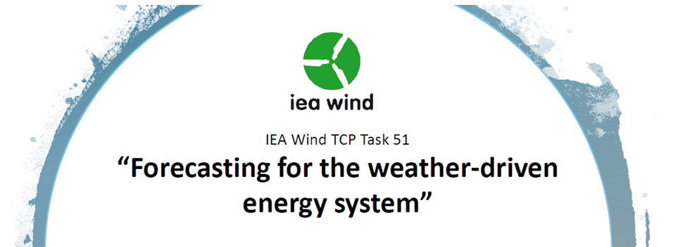

  

<!-- Not needed: 

   This is your intro/header image container --> 
<!-- 

   This adds padding on top -->

:::{.light-orange-div}
# IEA Wind TCP Task 51 "Forecasting for the weather driven energy system"

Das **Energiesystem der Zukunft ist ein vom Wetter getriebenes**. Um ein solches Energiesystem effizient und sicher zu betreiben, ist es von großer strategischer Bedeutung, den Einfluss von Wetterzuständen auf die Energieversorgung mit hoher Genauigkeit zu prognostizieren.

**Task 51 “Forecasting for the weather-driven energy system”** ist Teil des Wind Technology Collaboration Programmes (Wind TCP) der Internationalen Energieagentur (IEA). Er hat zum Ziel, nationale und internationale Expert:innen zu vernetzen, um den aktuellen Wissensstand der Industrie und Forschung zu erfassen und Forschungsbedarfe für die Zukunft zu identifizieren.

**Themenschwerpunkte von Task 51** sind: 

1. Ultrakurzfristvorhersagen (minute-scale bis hour-ahead)

2. subsaisonale/saisonale Vorhersagen

3. Extremereignisse im Energiesystem und deren Vorhersagbarkeit

4. Wert der Vorhersage für die Anwender:innen

5. Data Science und künstliche Intelligenz für das Energiesystem

Die **Wirkung der IEA TCP-Programme** ist klar belegt: Die Ergebnisse der Vorgängertasks von Task 51 der letzten 10-15 Jahre sind in Produktentwicklungen im Bereich der Erneuerbaren-Vorhersagen eingeflossen, die heute der gesamten Branche zur Verfügung stehen.

:::

:::{.hr}
:::
# IEA Task 51 in Österreich

:::{.left}
:::{.highlight-box} 
:::{.center-text}


**Team**
:::

**GeoSphere Austria**, **Austro Control Digital Services** **und WEB Windenergie**

nehmen für Österreich am Wind TCP Task 51 “Forecasting for the weather-driven energy system” teil.

:::
:::

:::{.middle}
:::{.highlight-box} 
:::{.center-text}


**Gestalten**
:::

**Gemeinsam gestalten wir ** 

die Zukunft des dezentralen, wettergetriebenen, datengetriebenen Energiesystems.
:::
:::

:::{.right}
:::{.highlight-box} 
:::{.center-text}


**Gemeinsam**
:::

**Gemeinsam arbeiten wir** 

an einem zukünftigen grünen Energiesystem mit hoher Resilienz gegenüber Wetterextremen und Klimawandel.
:::
:::

::: 
<!---columns--->

:::{.hr}
:::

:::{.light-gray-div}

::: {.blue-underline .center-text}

# Interesse mehr zu Prognosen für das Energiesystem zu erfahren und eigene Bedarfe einzubringen?
:::

Am 6.11.2024 findet in NH Danube City Hotel in Wien der **IEA Task 51 Österreich-Workshop** statt.

**Ziel des Workshops** ist es, Vertreter:innen der österreichischen Energiebranche und Forscher:innen detailliert über den State of the Art der Prognose des wettergetriebenen Energiesystems zu informieren. Im Rahmen interaktiver Sessions sind ihre Erfahrungen aus der Praxis und ihr Expert:innenwissen gefragt. Dadurch sollen aktuelle Bedarfe der Branche und spezifisch österreichische Fragestellungen erfasst werden und in die weiteren Forschungsaktivitäten von Task 51 einfließen.

Mehr dazu unter dem Reiter **Workshops**.

</a>

:::
::: 
<!---engage--->

:::{.hr}
:::

# Zahlen & Fakten

:::{layout-ncol=3}

:::{.left}

:::{.stat-box} 
:::{.center-text}

 

**14.000 Wasserkraftanlagen, +300 Windfarmen, +7.000 km Leitungsnetz**
:::

:::
:::

:::{.middle}
:::{.stat-box} 
:::{.center-text}


**€ 1 Milliarde jährlicher Kosten durch Extremwetterereignisse in Österreich**
:::

:::
:::

:::{.right}
:::{.stat-box} 
:::{.center-text}


**87% der Energieproduktion in Österreuch durch erneuerbare Energien**
:::

:::
:::

:::

:::{.hr}
:::
