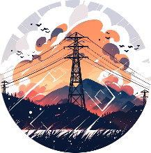

::: column-margin
```{r, echo=FALSE}

```
:::

An overview over the resources we use, where to find information, etc.

Will be gradually filled with content.

# GCM and RCMs used

# Dynamical and empirical-statistical downscaling

# Machine-learning based model mixing


